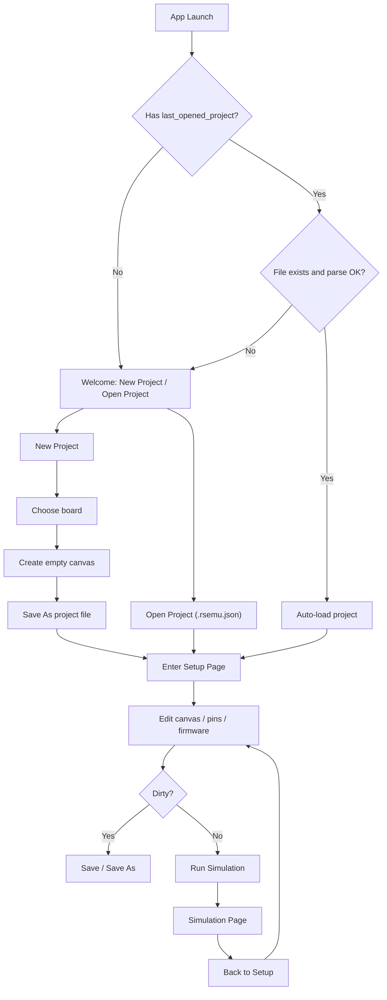

# rsemu-gui Project Schema and Interaction Flow (MVP v1)

本文档定义 GUI 的 `project` 文件结构与核心交互流程，用于支持：

- 项目文件加载/保存（Open / Save / Save As）
- 记住并自动加载上次打开的项目
- 将“板子选择”收敛为项目级元数据，而不是每次运行都重复选择

## 1. Goals

1. 用户可以通过一个项目文件完整恢复调试上下文（板子 + 固件 + 外设布局与配置）。
2. 应用启动后优先恢复最近一次项目，尽量做到“打开即调试”。
3. Schema 具备版本字段，支持后续兼容迁移。

## 2. Project File Format

推荐扩展名：`*.rsemu.json`

```json
{
  "schema_version": 1,
  "project": {
    "name": "blink-demo",
    "created_at": "2026-04-03T10:00:00Z",
    "updated_at": "2026-04-03T10:30:00Z"
  },
  "target": {
    "board": "stm32f103"
  },
  "firmware": {
    "path": "firmware/blink.bin",
    "path_kind": "relative"
  },
  "canvas": {
    "items": [
      {
        "instance_id": "inst_1712123000000_0",
        "type": "led",
        "position": { "x": 120, "y": 90 },
        "config": {
          "type": "led",
          "id": "LED_USER",
          "pin": { "port": "C", "pin": 13 },
          "active_low": true
        }
      },
      {
        "instance_id": "inst_1712123000000_1",
        "type": "uart",
        "position": { "x": 320, "y": 120 },
        "config": {
          "type": "uart",
          "usart": "USART1"
        }
      }
    ]
  },
  "ui": {
    "last_page": "setup"
  }
}
```

### 2.1 Field Semantics

1. `schema_version`：必填，当前固定为 `1`。
2. `project.name`：项目显示名。
3. `project.created_at` / `project.updated_at`：ISO-8601 UTC 时间。
4. `target.board`：后端识别的 board id（如 `stm32f103`、`stm32f407`）。
5. `firmware.path`：固件路径，建议优先相对项目文件目录。
6. `firmware.path_kind`：`relative` 或 `absolute`。
7. `canvas.items`：与 GUI 当前 `CanvasItem` 结构一一对应。
8. `ui.last_page`：可选，仅用于体验恢复，不影响仿真正确性。

### 2.2 Compatibility Rules

1. 读取时若 `schema_version` 缺失或未知，提示“不支持的项目版本”并拒绝加载。
2. 可选字段缺失时使用安全默认值（例如 `ui.last_page = "setup"`）。
3. `target.board` 必须是支持列表中的值；未知时直接报错，不允许静默回退。

## 3. App-Level Preferences (Not in Project File)

用于“记住上次项目”和“最近项目列表”，与具体项目内容解耦：

```json
{
  "last_opened_project": "/abs/path/to/demo.rsemu.json",
  "recent_projects": [
    "/abs/path/to/demo.rsemu.json",
    "/abs/path/to/uart.rsemu.json"
  ]
}
```

建议约束：

1. `recent_projects` 去重，按最近使用排序。
2. 列表长度上限建议 `10`。
3. 启动自动加载失败（文件不存在/解析失败）时，清理失效路径并进入欢迎页。

## 4. Interaction Flow (MVP)



## 5. UI Behavior Notes

1. Setup 顶部展示“当前项目 + 当前板子”，不再长期展示大面积板子卡片。
2. 板子变更仅在 New Project 或 Change Board 动作中发生。
3. Change Board 时必须二次确认，因为会使现有外设配置失效或需要迁移。
4. 存在未保存变更时，关闭/切换项目需要确认（Save / Discard / Cancel）。

## 6. MVP Scope Boundary

本阶段必须做：

1. New / Open / Save / Save As。
2. 启动时自动加载 `last_opened_project`。
3. 基于 `schema_version = 1` 的读写与基本校验。
4. 最小脏状态提示（unsaved changes）。

本阶段可暂缓：

1. 多版本 schema 迁移器。
2. 项目内多配置 Profile（Debug/Release）。
3. 自动检测固件文件变化并提示 reload。
